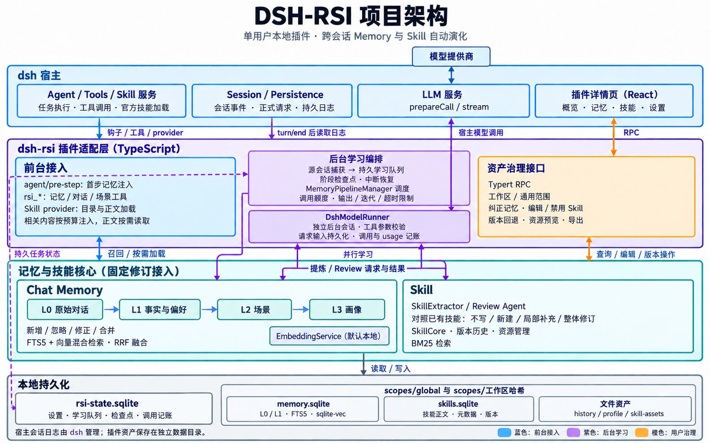
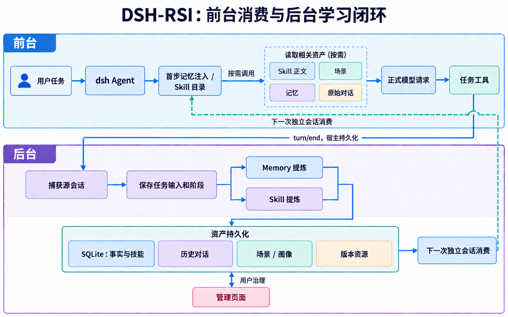
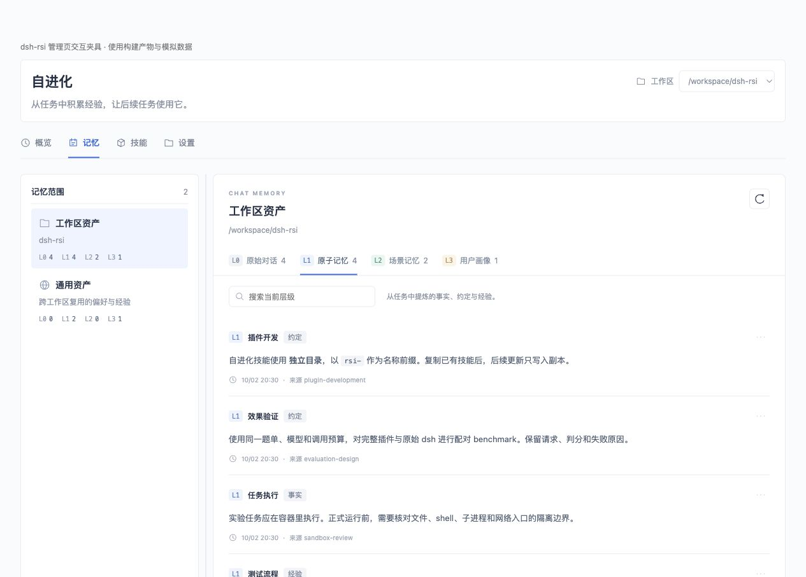
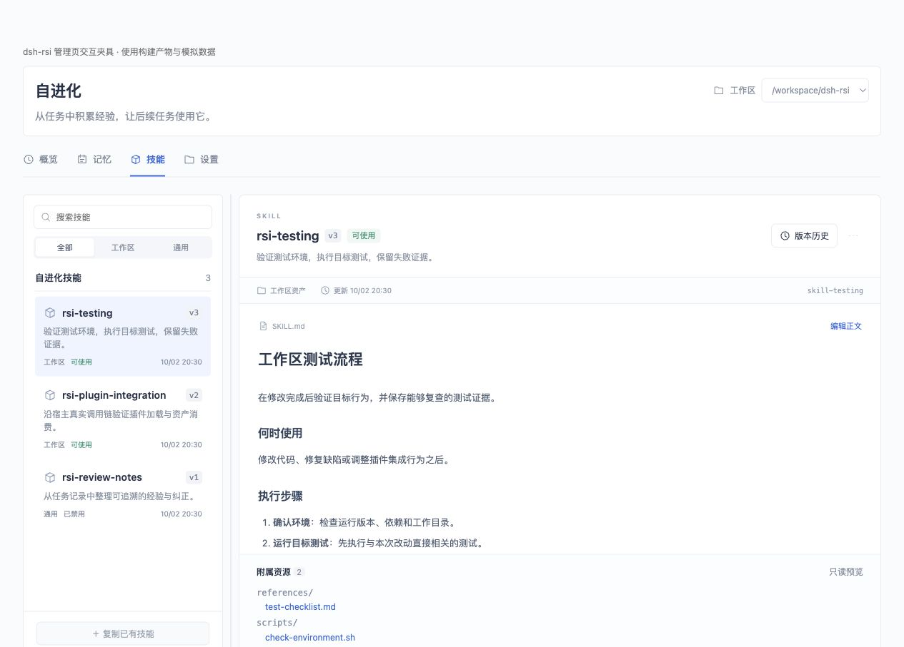

# dsh-rsi

**让 dsh 的任务经验积累为记忆与技能，供下一次任务使用。**

dsh-rsi 是面向 DeepSeek Harness（dsh）的单用户、本地自动学习插件。它从会话中提炼 Chat Memory 和 Skill，在后续任务中召回相关记忆、加载适用技能，并提供集成在插件详情页里的资产管理界面。

当前为开发版本：本地安装、管理页及真实模型下的记忆与Skill正文消费已通过小型验收。首轮配对结果见[历史报告](docs/formal-results-20261003.md)；原生能力修复后的[推进路线](docs/rsi-roadmap-20261004.md)另行记录。PersonaMem预演两组均2/2，只说明这一个开发用户上的接入与答题通过；通用Skill过长和资源拆分仍是已知限制，新独立效果实验尚未开始。

[产品定位](#产品定位) · [项目架构](#项目架构) · [工作流程](#工作流程) · [管理页面](#管理页面) · [工作区与存储](#工作区与存储) · [安装与开始使用](#安装与开始使用) · [验证状态](#验证状态) · [开发与贡献](#开发与贡献)

## 产品定位

使用 Agent 开发项目时，一些信息需要反复解释：项目约束、个人偏好、历史问题，以及已经执行过的排查和测试流程。dsh-rsi 的目标是把这些经验保留下来，让新会话能够继续使用。

插件围绕两类资产工作：

- **Chat Memory**：保存对话来源，提炼事实、约定与经验，进一步整理场景记忆和用户画像。
- **Skill**：从任务轨迹中创建或改进可复用流程，保留正文、资源文件和版本，按需交给 dsh 使用。

适合在同一项目中持续开发、反复执行相似工作，或希望跨项目保留个人偏好的用户。目标是减少重复解释、重复探索和重复错误；是否达到这些目标，需要通过实验验证。

### 自进化的范围

自进化发生在**资产层**：记忆被提炼、去重、合并和纠正；技能被创建、更新和复用。每次任务可以更新已有资产，也可以不产生新资产。

插件本地运行，无需单独部署完整资产管理后台。首版不包含 Wiki、CodeGraph、团队与权限管理、Agent/Task 管理、模型权重训练或插件自身源码修改，也不会自动索引整个代码库。

## 项目架构

插件通过宿主生命周期钩子、官方 Skill provider 与 Typert RPC 接入 dsh，将前台资产消费、后台学习编排和管理页面连接到本地记忆与技能核心。



Memory 使用 FTS5 与向量混合检索，Skill 使用 BM25 检索。后台提炼通过 `DshModelRunner` 调用宿主 LLM 服务；任务状态与资产保存在插件数据目录，正式会话日志由 dsh 管理。

## 工作流程

启用插件后，继续在 dsh 中正常做任务。插件捕获任务轮次，后台学习，后续会话按需消费资产。



### 什么数据形成什么资产

| 输入 | 资产 | 后续如何使用 |
| --- | --- | --- |
| 用户与助手的对话正文 | L0 原始对话 | 回看来源，主动检索历史对话 |
| 对话中的事实、约定、偏好与经验 | L1 原子记忆 | 按当前请求检索相关内容 |
| 累积的 L1 记忆与已有场景 | L2 场景记忆 | 提供场景导航，按需读取 Markdown 正文 |
| 变化的 L2 场景与已有画像 | L3 用户画像 | 提供稳定的背景和偏好 |
| 对话、工具调用与结果、轮次结束原因、已有技能 | Skill 正文、资源与版本 | 通过 dsh 官方技能接口按需加载 |
| 用户主动选择的已有技能 | 独立的 RSI 技能副本 | 在副本上继续演进 |

当前 L0/L1 使用用户和助手正文；Skill 提炼额外使用工具调用与结果。Memory 与 Skill 是两条学习分支，Skill 不需要等待 L1→L2→L3 全部完成。任务结束不保证产生新资产，也不代表任务已经被正确解决。

### 如何进入模型上下文

- 每轮第一个模型步骤前，按用户请求检索通用与当前工作区记忆，提供相关 L1 内容、已有画像和场景导航。
- 记忆以带插件来源的正式消息进入会话日志，再发送给模型。需要更多内容时，模型可调用 `rsi_memory_search`、`rsi_conversation_search` 和 `rsi_profile_read`。
- 技能通过官方 Skill provider 暴露为 `rsi-<名称>`；dsh 的技能工具按需加载正文和对应版本的资源。
- 历史资产的验证结果标为来源会话记录；读取Skill不代表本轮执行了其中的代码或测试。对应提示经正式日志保存，但不作为用户偏好再次学习。
- 默认记忆注入上限为 6000 字符，不把全部资产一次性放入上下文。工具后续读取的内容另算。

后台学习也使用 dsh 的模型服务，发送前保存可重建的输入，记录工具调用、用量与结果。原始任务会话与后台学习会话保持关联。

### 一个使用示例

假设你在项目中要求“修改解析规则后，运行指定回归测试并保留失败日志”，随后完成了一次修复。

| 可能积累的资产 | 示例内容 |
| --- | --- |
| L1 记忆 | 当前项目修改解析规则后，需要执行指定回归测试 |
| L2 场景 | “解析器维护”：相关约束、排查经验和验证方式 |
| Skill | `rsi-parser-regression`：定位问题、修改规则、执行测试、检查结果 |

下一次相关任务可以召回约定，并按需加载技能。以上是产品行为示例，不是实测产物或效果数据；模型也可能判断信息不足、更新已有资产或保持不变。

## 管理页面

入口：**dsh 左侧「插件」→ 已安装的 dsh-rsi → 插件详情页**。

| 页签 | 可以做什么 |
| --- | --- |
| 概览 | 选择工作区，查看资产数量、学习记录和额外模型用量，处理待学习任务 |
| 记忆 | 浏览 L0–L3、筛选与搜索、查看来源，纠正或删除 L1 记忆 |
| 技能 | 查看和编辑正文、预览资源、查看版本与变更片段、禁用、回退、复制为通用技能 |
| 设置 | 配置资产语言、学习与预算参数，导出或清理资产 |

停止使用时，直接关闭 dsh 的插件启用开关。概览没有单独的暂停/恢复按钮；设置中的自动学习配置可用于维护资产。

纠正记忆会更新实际检索结果，旧的派生场景与画像暂不参与注入，待重建后恢复。Skill 禁用影响后续加载；回退把选定旧版本的正文和资源保存成新版本。

**以下截图来自管理页交互夹具，使用模拟数据展示布局与操作，不代表真实任务产物或 benchmark 成绩。**

### 记忆管理



### 技能管理



官方运行时的实际页面挂载、RPC 设置保存和启停记录见 [管理页验收](docs/client-mount-review.md)。当前 L2/L3 不支持直接管理编辑，技能资源只读预览，尚无资源文件编辑器和导入恢复向导。

## 工作区与存储

### 资产默认属于哪个工作区

以 **dsh 会话绑定的工作区目录**为准。同一真实路径下的不同会话，共用该工作区的资产；工具临时 `cd` 到子目录不会改变归属。直接绑定子目录的新会话会形成另一个工作区，当前没有自动寻找 Git 根目录的逻辑。

| 资产 | 默认归属 |
| --- | --- |
| 项目事实、约束、经验和生成的技能 | 当前工作区 |
| 提炼时被分类为 `persona` 的个人偏好记忆 | 通用范围 |
| 用户明确复制为通用的技能 | 通用范围 |

后续任务可以使用当前工作区与通用范围的资产。其他工作区的专属资产不会一起加载；个人偏好的分类由模型完成，准确性仍待真实任务验证。

已有技能只有经用户选择才会复制到插件管理范围，包括其本地资源。后续演进写入副本，原技能由用户继续维护。

### 实际保存位置

默认根目录为 `$DSH_HOME/plugin-data/dsh-rsi`；没有设置 `DSH_HOME` 时，使用 `~/.dsh/plugin-data/dsh-rsi`。插件的 `dataDir` 配置可覆盖为其他绝对路径。

```text
dsh-rsi/
├── rsi-state.sqlite                 设置、队列、调用记账与检查点
├── scopes/
│   ├── global/                      通用资产
│   └── <工作区真实路径的哈希>/         工作区专属资产
│       ├── memory.sqlite            L0/L1、全文与向量检索索引
│       ├── skills.sqlite            技能正文、元数据与版本
│       ├── skill-assets/            按技能 ID 和版本存储的附件
│       ├── history/                 对话与记忆追加历史
│       └── profile/                 场景、画像和派生检查点
└── learning-runs/                   后台学习与来源会话的关联记录
```

通用范围采用同样的资产结构。数据位于插件目录，不默认写入项目源码目录或原有技能目录。Skill 正文以数据库为权威源，附件按版本保存；后台会话日志本体由 dsh 管理。

**本地存储与模型推理是两件事。**学习使用配置在 dsh 中的模型，相关对话片段和资产内容会进入该模型的请求；使用远程提供商时，推理发生在提供商侧，并产生额外调用成本。

## 安装与开始使用

### 环境要求

- 官方 dsh；当前兼容检查目标为 `0.2.0-rc.2`、Cordis `4.0.4`。
- 本地源码构建使用 Node.js 24。
- 自动学习需要 dsh 中可用的模型配置；默认跟随来源会话的模型。

### 1. 获取并构建源码

```sh
git clone https://github.com/lsmax-72/dsh-rsi.git
cd dsh-rsi
npm ci
```

`npm ci` 会通过 `prepare` 自动生成 `lib/`。如果使用 `--ignore-scripts`，需要另行执行 `npm run build`。

### 2. 在桌面版安装

在源码目录执行 `pwd`，复制得到的绝对路径。打开 dsh **插件 → 添加插件**，输入该目录，安装并启用，然后打开插件详情。

当前已验证本地目录链接安装。源码更新后，在目录内执行 `npm run build`，完整退出并重新打开 dsh，让宿主重新加载客户端产物。

包仍为 `private: true`，尚未发布 npm 包。dsh 支持 GitHub 地址安装，但本项目通过远程 Git URL 的完整安装流程尚未验收。

### 可选：独立网页测试 profile

以下命令在已构建的源码目录中执行；`dsh` CLI 需要已加入 PATH。

```sh
dsh --profile rsi-dev --from-default-profile web --help
dsh plugin --profile rsi-dev add "$(pwd)"
dsh --profile rsi-dev --no-open
```

第一步从官方 web 模板初始化测试 profile，最后一步打印网页入口。profile 分开不代表资产目录自动分开；要隔离日常数据，应使用独立 `DSH_HOME` 或显式设置插件 `dataDir`。测试 profile 本身也不是任务执行沙箱。

### 3. 开始积累经验

1. 在 dsh 中选择项目工作区，正常执行任务。
2. 打开插件「概览」，查看学习记录、用量和失败原因。
3. 在「记忆」「技能」中检查生成或更新的内容，按需纠正、编辑或禁用。
4. 在同一工作区的新会话中继续任务，插件会召回记忆，并向官方技能接口提供可用的 RSI 技能。

初次安装没有资产是正常的。缺少模型配置、学习开关关闭或预算耗尽时，不会开始新的学习请求；管理页会显示相应任务状态。任务“已完成”表示 L0、L1 与 Skill 阶段完成，L2/L3 可能仍在后台处理。

## 默认设置与成本

| 配置 | 默认值 |
| --- | --- |
| 自动学习 | 开启 |
| 新资产语言 | 简体中文；支持英文、日文、韩文和繁体中文 |
| 每日后台模型请求上限 | 100 次 |
| 单次输出上限 | 4096 token |
| 单次工具迭代上限 | 16 次 |
| 单次超时 | 180 秒 |
| 学习触发 | 稳定阶段每 2 轮或空闲 30 秒，保留首次 warmup |
| 自动记忆注入上限 | 6000 字符 |

每日额度按 UTC 日期重置，包含工具循环和失败的每次模型请求，**不是费用金额上限**。页面展示调用与提供商报告的 token 用量；未报告的用量保留为未知。预算耗尽会暂停新学习请求，已保存的资产仍可消费。

切换语言影响后续生成；已有资产可以手动转换，保留历史。代码、命令、路径和 API 标识保持原样。手动转换也消耗后台模型调用预算。

## 验证状态

| 验证内容 | 当前证据与边界 |
| --- | --- |
| 学习与消费链路 | 固定响应与真实默认流程均验证自动捕获、提炼、资产写入及记忆/Skill 正文消费；真实会话已自然选择新 Skill，尚无质量或迁移收益结论 |
| 资产管理与恢复 | 固定响应检查覆盖工作区隔离、预算、禁用、回退、附件和独立进程恢复 |
| 官方管理页面 | 独立 web profile 通过实际挂载、页签切换、RPC 设置保存与插件启停；个人桌面修复后的结果仍待用户确认 |
| 安装包 | 本机 macOS ARM64 检查通过；远程 Linux/macOS/Windows 的源码构建与生产包安装检查全部通过，见 [CI 回执](docs/evidence/package-ci-20261003.json) |
| 容器执行 | Linux 容器内真实工具与固定响应资产闭环通过；固定模型网关边界与 qwen 工具调用通过 |
| 真实任务与效果 | 首轮固定 20 对后序：基线 8/20、插件 10/20；全链路 token 分别 12,119,317 / 已知下限 19,013,922，另 1 次 usage 未知（包含暂停的 1 次）；见 [正式报告](docs/formal-results-20261003.md)，不等同于稳定收益 |

本次试跑的失败原因、调用成本和接入缺口见 [真实试跑报告](docs/real-pilot-20261003.md)。同一题补跑与剩余门槛见 [补跑报告](docs/real-pilot-retry-20261003.md)。默认自动学习、自然 Skill 消费与新增成本见 [默认流程预演](docs/default-flow-preflight-20261003.md)。这些接入结果不能证明或否定插件相对效果。

本轮效果评测比较 **原始 dsh 与完整 dsh-rsi**：保持题单、模型和任务预算一致，检查前序任务积累的经验能否改善后序任务，报告成功率、退步、学习开销和总成本。资产数量或页面展示不能代替效果结论。协议见 [整体验收与实验方案](docs/evaluation-plan.md)及 [已确认的固定方案](docs/paired-experiment-proposal.md)。

## 开发与贡献

### 代码组织与复用边界

```text
vendor/core/    固定版本的记忆、技能、存储与调度源码
vendor/panel/   复用的资产列表、分栏、Markdown、文件树与样式
adapters/      模型入口、观测及界面依赖的宿主适配
src/           dsh 事件与模型桥、作用范围、队列、预算、RPC 和管理页
scripts/       构建、来源校验、安装包和集成检查
docs/          需求、实现边界、评测协议与运行证据
```

核心固定为修订 `e09899c2136fb6bc27ecc68505e32bdb637cdfa8` 的源码文件，数量以核心清单为准；界面固定复用 10 个文件，其中文件树和对应样式从原详情页提取。构建前核对逐文件 SHA-256。必要适配留在 `adapters/` 与 `src/`，没有平行重写提炼、召回或版本系统。

当前 Chat Memory 使用原生 SQLite FTS5、向量检索与 RRF；Skill 保留原生 BM25。默认本地向量模型为 embeddinggemma-300m-qat Q8_0（768 维），首次需下载约 329 MB；离线使用时通过插件配置 `embedding: {provider: "local", modelPath: "/绝对路径/embeddinggemma-300m-qat-Q8_0.gguf"}` 指定已下载文件。编码失败显式报错，首次模型加载及历史索引重建可能延长插件启动时间。2026-10-04 装配审计还确认了 Skill 生产提示词替换、画像触发缺失、资产分页遗漏、上下文截断和错误重试接线问题，见 [能力装配审计与隔离复现](docs/native-capability-audit-20261004.md)，最新修复状态见 [修复进度](docs/native-capability-repairs.md)。七类装配问题已逐项修复并保存接入回执；新增原生依赖的 Linux/macOS/Windows 安装检查全部通过。接入验收不等于效果改善；首轮实验结果对应此前适配版。构建成功也不代表通过了整个复用库的类型检查。来源、固定文件及许可见 [核心清单](vendor/core/manifest.json)、[界面清单](vendor/panel/manifest.json)、[核心许可](vendor/core/LICENSE)和[界面许可](vendor/panel/LICENSE)。

### 开发检查

```sh
npm run build
npm run test:integration
npm run test:runtime
npm run test:package
```

集成脚本使用临时目录与固定模型响应，不调用真实模型；macOS 默认使用应用内 CLI，其他安装通过脚本的 `--dsh` 参数指定。安装包检查需要下载依赖。管理页模拟数据预览可通过 `node scripts/preview-client.mjs` 启动，默认地址为 `http://127.0.0.1:45177/`。

贡献时先阅读 [项目约定](AGENTS.md)：优先调用已有组件，只做必要的适配；说明复用与新增边界，并为修改保存与其范围相符的证据。每个可独立验收的小任务完成后单独提交，提交前检查差异和有效 Git 身份；不把多个任务攒成一次大提交，也不为增加数量拆分无意义提交。

## 进一步阅读

- [产品需求与范围](docs/product-requirements.md)
- [实现进度、默认目录和已知限制](docs/implementation-progress.md)
- [dsh 接入审查](docs/integration-audit.md)
- [安装包与发布审查](docs/packaging-review.md)
- [管理页面复用说明](docs/ui-reuse.md)
- [实际管理页挂载验收](docs/client-mount-review.md)
- [固定响应下的闭环回执](docs/evidence/runtime-phase2.json)
- [整体验收与实验方案](docs/evaluation-plan.md)
