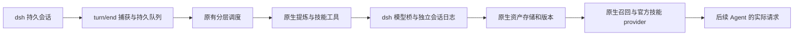

# dsh-rsi 实现进度

更新：2026-10-04。兼容目标为官方安装版 dsh `0.2.0-rc.2`、Cordis `4.0.4`、Node 24。已有可构建的本地开发插件；尚未公开发布；首轮固定题单的真实模型配对实验已完成，结论与限制见 [正式报告](formal-results-20261003.md)。

当前推进目标见 [修复与持续学习路线](rsi-roadmap-20261004.md)：七项修复 → 开发回归 → PersonaMem 小型预演 → 新编程序列连续学习。旧 20 题只用于开发回归；后续结果不再作为独立盲测成绩。

## 2026-10-04 装配审计补充

[能力装配审计](native-capability-audit-20261004.md)确认：复用文件内容完整，但向量链路、Skill 生产提示词、画像触发/计数和部分诊断没有按原生生产装配接入；分页、上下文裁剪及错误传播存在可复现缺陷。以下已有检查证明的是组件调用和宿主接口闭环，不能据此宣称完整原生策略等价。首轮正式实验和冻结资产原样保留；该审计记录反映修复前状态；七类问题随后已逐项修复，最新证据见 [原生能力修复进度](native-capability-repairs.md)。尚未开始新一轮正式实验。

## 已实现并验证

| 能力 | 实现与证据 |
| --- | --- |
| 自动任务捕获 | 监听正式 `session/event` 中的 `turn/end`，等待宿主持久化后读取原始日志；固定响应夹具下，真实 Agent 的任务进入学习队列 |
| 原生 Chat Memory | 使用复用的 L0 记录、L1 提炼/去重/写入、SQLite FTS5 与向量 RRF 召回、L2 SceneExtractor、L3 PersonaGenerator |
| 原生 Skill 自进化 | SkillExtractor 原有工具循环调用 SkillCore、版本与资源存储；使用固定本地身份映射，没有管理服务栈 |
| 后续任务消费 | 使用 `agent/pre-step` 注入正式消息，官方技能 provider 与 `skill` 工具加载实际正文；持久日志重建与实际模型请求一致 |
| 资产管理 | 记忆纠正、技能禁用和版本回退影响实际消费；已有技能复制含二进制资源，通用副本跨工作区可见 |
| 隔离和恢复 | 工作区通过规范化真实路径哈希映射到独立目录；通用资产单独存放；独立进程恢复资产、版本及中断记录 |
| 预算 | 每次后台模型 dispatch 前预留调用额度；额度耗尽不发送新请求；缺失 token 用量保留未知状态 |
| 管理 API | 官方 Host Gateway + 官方 Client RPC 投影实际调用成功；客户端主动挂载自己的 namespace |
| 资产语言 | 默认 `zh-CN`，切换影响后续生成；手动转换使用同一模型桥，保留 Skill 历史版本与记忆追加历史 |

回执：[闭环检查](evidence/runtime-phase2.json)、[模型桥接检查](evidence/bridge-phase2.json)。这些检查使用临时 DSH_HOME、临时资产和固定模型响应；没有调用真实提供商，没有执行任务代码。原生 L2/L3 方法及其工具和召回已经实测；定时器在长期会话中的调度和恢复尚需长时间试用。

## 界面

已编写插件详情页的「概览 / 记忆 / 技能 / 设置」四个标签，包括工作区选择、学习状态与队列、搜索与纠正、版本正文和变更片段、禁用、复制、语言、预算、导出和清理。

客户端按官方闭包工厂格式构建，通过 `plugins.bundle.config` 插槽注册。Browser 交互夹具加载同一个构建产物，验证渲染、记忆编辑、版本窗口和设置控件。界面夹具使用模拟业务数据；官方 Client→Host Gateway 的调用另外在安装版运行时验证。**用户桌面已安装本地链接。管理页缺失已修复，独立官方 web profile 已通过实际挂载、页签切换、设置保存与启停检查；个人桌面重启后的修复结果待用户确认。**

## 核心复用与新增边界

运行时复用源码文件来自固定修订 `e09899c2136fb6bc27ecc68505e32bdb637cdfa8`，构建前逐文件校验哈希。算法源文件未修改。新增的是宿主事件适配、正式模型日志、物理工作区映射、插件队列/预算、管理 API 和界面。

构建适配仅替换三个宿主边界：要求注入 dsh runner、复用原生 FileLogger 并保存本地事件/指标/trace、隔离原宿主日志目录。没有另建 Python 记忆/技能实现，没有直接请求提供商的模型客户端。复用源码有少量未纳入运行时构建的类型依赖；当前构建不是完整原仓库的类型检查。

## 调用链与日志

模型桥先写入并 flush 标准日志事件，再执行正式 `prepareCall().stream()`。这是同一个 `llm/stream` waterfall。工具执行前保存完整调用；参数校验、迭代限制、模型错误、预取消、超时和失败收尾均已检查。后台没有终端或工作区写文件工具；L2/L3 仅操作自己的 profile 存储，Skill 工具仅操作自己的资产库。

任务队列保存完整源日志和处理阶段，重启将正在处理的工作标为中断。已保存的阶段可以跳过；崩溃发生在写资产与保存阶段之间时，仍可能重复提炼。不能声称整轮事务回滚或恰好执行一次。失败记录提示可能存在部分更新。

## 默认设置与目录

默认目录：`$DSH_HOME/plugin-data/dsh-rsi`；没有 DSH_HOME 时为 `~/.dsh/plugin-data/dsh-rsi`。可通过插件配置覆盖绝对 `dataDir`。内部结构：

- `rsi-state.sqlite`：设置、调用计数、任务队列及原生管道检查点。
- `scopes/global/`：通用资产。
- `scopes/<workspace-hash>/`：工作区资产；各自有记忆数据库、技能数据库、JSONL 历史、技能附件和场景画像。
- `learning-runs/`：后台日志与来源关联。会话日志本体由宿主持久化服务管理。

同一数据目录只允许一个活跃实例，避免两个进程同时学习。工作区以 realpath 区分，因此同一目录的符号链接名称不会产生两个资产库。

默认：自动学习开启，语言中文；每日 100 次后台请求；单次最多 4096 输出 token、16 次模型迭代、180 秒超时；稳定阶段每 2 轮或空闲 30 秒触发。保留原生 warmup，因此首次任务可能立即学习。每日额度按 UTC 日期重置，包含失败请求和工具循环的每次 dispatch，不是每日成本金额上限。

L2 采用原生延迟/间隔规则；手动「处理待学习任务」等待 L1 和 Skill，L2/L3 仍按原生队列继续。修改学习间隔会重建原生管道，管道销毁遵循原有 flush 语义。语言转换和画像重建是用户明确发起的学习调用，即使自动学习暂停也允许执行，但仍受每日预算约束。

## 管理语义与限制

- 技能对 dsh 的名称是 `rsi-<原生名称>`，独立目录与 provider 避免覆盖已有技能。
- 禁用只影响消费，不删除历史。回退把旧正文和附件写成新版本；原有过期版本规则仍适用。
- 记忆纠正更新原生索引并保存历史；旧场景/画像暂不注入，随后分层重建或手动重建后恢复。
- 导出包含当前记忆、记忆追加历史、Skill 历史正文/附件、派生 profile 文件和队列来源；尚无导入恢复向导。
- 清理需要暂停学习、等待当前任务结束、输入确认。删除所选范围内的插件资产、历史版本和队列；宿主原始会话日志、预算记账和来源游标继续保留，避免清理后重学旧任务。后台日志本体及其关联索引不因资产清理而自动删除。
- 自动 `persona` 类型进入通用库，其余记忆保持工作区范围。具体模型分类准确性尚未通过真实任务验证。
- Chat Memory 已启用原生本地编码、sqlite-vec 与 hybrid/RRF；Skill 保留原生 BM25。原生向量输入上限为 512 字符，成本记录编码次数/字符/耗时，未提供的 token 保持未知。
- 本地包保持 `private: true`；源码、管理页面和运行时接口均不是经过正式发布验收的版本。

## 下一阶段

1. 临时桌面/网页 profile 中完成本地 bundle 安装、管理页挂载和启停验收。
2. 把实际 Agent 的全部任务工具放入容器，验证所有文件、shell、子进程入口及网络边界；禁止把 sdk-minimal 默认 profile 当作实验沙箱。
3. 验证官方判分器，再固定题单、模型、预算及快照协议，运行完整插件与原始 dsh 的配对 benchmark。

本机 Docker Server `29.0.1` 可用。只读可用性检查不等于任务执行隔离已经成立；目前没有正式任务分数或效果数据。

## 管理页面改版与复用约束

管理页改为已有资产工作台的列表/详情结构。直接复用分栏拖拽、资产列表、页头、Markdown 组件和技能资源文件树；保留源文件与哈希，必要的宿主包装、样式变量和数据绑定在适配层完成。详见 [管理页面复用记录](ui-reuse.md)。

新增的分层浏览、技能编辑和资源预览接口均调用原生存储/版本方法。运行时验证覆盖 L0–L3 的管理读取、原生 META 解析、版本冲突及资源路径校验，未调用真实模型。后续开发按 `AGENTS.md` 的最小修改与直接复用要求执行。

## 安装包检查

增加 `prepare` 源码构建钩子，显式外置 React 与 JSX runtime，并用构建依赖图检查没有嵌入 React。全新源码目录的安装生命周期、tarball 生产依赖安装、服务端导出和原生中文 FTS 分词在 macOS ARM64 上通过；生产消费者不含 esbuild。见 [安装包回执](evidence/package-20261002.json)与[发布审查](packaging-review.md)。

Linux/macOS/Windows CI 配置已提交并推送，运行结果尚未核对。远程 Git URL 安装、桌面挂载、跨平台结果及真实 benchmark 仍未验收，`private: true` 保持为当前开发包的发布保护。

## 实际客户端挂载（2026-10-03）

修复 keyed 插槽误用 id 和缺少包清单导出的问题。独立官方 web profile 的管理页、实际 RPC 设置保存、停用卸载与重新启用均通过；自动学习暂停，模型调用为 0。见 [挂载修复记录](client-mount-review.md)和[回执](evidence/client-mount-20261003.json)。个人桌面更新后仍需用户确认，真实模型和任务容器验收仍待完成。

## 概览操作简化（2026-10-03）

按用户要求删除概览中的暂停/恢复学习按钮，停止使用通过 dsh 插件启停开关完成。设置中的自动学习配置继续用于资产维护与已有暂停状态；后台预算和队列逻辑未改动。

## 容器内真实工具与 Linux 资产闭环（2026-10-03）

新增可重复的 `npm run test:container` 检查，使用官方 npm CLI `0.2.0-rc.2` 与当前插件源码副本，整个 dsh 运行在容器内。两种官方 Bash 实现、文件读写编辑、ripgrep 搜索、PTC 直接 Node/子进程和嵌套工具调用均通过；宿主标记文件不可见，外网连接失败，镜像写入失败，子进程保持非 root。Docker 配置检查确认无宿主 bind/volume/socket，断网、只读 rootfs、capabilities 全部移除，设置 CPU/内存/进程数限制。

同一 Linux ARM64 镜像复用已有完整资产闭环检查，通过中文分词、L0–L3、Skill 提炼、实际后续请求消费、版本和独立进程恢复。没有改动后端和冻结核心。详见 [执行边界说明](experiment-container.md)与[回执](evidence/container-isolation-20261003.json)。本检查使用固定模型响应，没有真实任务成绩；联网模型服务的 egress 与官方判分尚未验收。用户已明确：仅继续到少量真实任务试跑，优先 `qwen3.8-27b`，正式配对 benchmark 前停止。

## qwen 模型接入检查（2026-10-03）

固定模型网关与内部 Docker 网络已通过外网阻断、错误 URL/模型拒绝和指定服务可达检查。官方模型适配器完成真实写文件与读取工具调用，共 3 次请求；请求计数与网关计数一致。没有改动插件后端或另写模型客户端。见 [兼容性回执](evidence/model-compatibility-20261003.json)。两道 Django 接入任务正在运行，尚无可报告的任务效果；正式配对 benchmark 不在本轮授权范围内。

## 官方判分器检查（2026-10-03）

全新固定 SWE-bench 3.0.0 环境的 50 个源文件发行哈希全部匹配。两道任务的官方正确补丁均通过，非空错误补丁均失败，真实测试结果解析完整；沿用官方判分和解析，不使用此前被修改的环境。详见 [判分器检查](scorer-validation.md)。本项只确认测量工具，不是模型成绩或插件效果。

## 少量真实试跑结束与正式实验停止（2026-10-03）

完整插件与 qwen3.8-27b 在隔离任务容器中运行两题。第一题取消、第二题输出截断，官方判分均 resolved=false。原生后台共 5 次调用，形成 L0=5、Skill=1、L1/L2/L3=0，没有真实后续资产消费；接入验收未完成。30 次模型请求与网关一致，总计 721412 token。

修正了试跑驱动误标完成状态及预算配置层级错误，没有改动冻结核心或改变 aborted 的产品行为。完整原始轨迹保存在被忽略的 .artifacts/pilot-20261003，报告与哈希已提交。详见 [真实试跑报告](real-pilot-20261003.md)。本轮不再扩量，正式配对 benchmark 未启动。

## 成功案例门槛与 token 口径（2026-10-03）

按用户要求，正式实验前至少需要一次真实官方判分成功，同时验证真实资产的后续消费。实验方案现已明确前台、后台、全链路 token、配对净增减、固定后序题数的学习摊销和每个成功结果的开销。审计脚本从已有真实请求拆出前台 639065、后台 82347 token；原始证据哈希未变。没有对照组，不能把后台占比当作完整插件的净增开销。本次未新增模型请求。

## Windows 安装 CI 已修复（2026-10-03）

通过 .gitattributes 固定冻结源码 LF，避免 Windows checkout 自动转换导致哈希不匹配；校验逻辑和 manifest 保持不变。新运行 37090163386 的 Linux/macOS/Windows 安装及生产包烟测全部成功。工作流增加安装输入 paths，纯文档提交不再触发。没有修改个人 GitHub 邮件通知设置。

## 两类资产上下文验收门槛（2026-10-03）

正式实验前分别验证真实 Chat Memory 的召回正文与真实 Skill 的官方工具加载正文进入后续独立会话的实际模型请求，两项必须同时通过。方案增加资产来源、工作区/通用范围、Skill 版本、内容哈希、可见正文和对应请求日志重建的核对口径；候选目录、资产数量及固定响应结果不能替代真实验收。目前真实修复成功、真实 Memory 注入、真实 Skill 正文消费均未通过；本次仅更新协议，没有新增模型调用或开启正式实验。

## 2026-10-03：补跑评分与提炼窗口

同一题真实补丁获官方 resolved=true；Agent 因试跑请求预算结束，正常完成协议尚未通过。最小适配使用原接口 maxMessagesPerExtraction 保留工具密集轮次开头的用户要求，冻结核心哈希不变，17 条消息回归夹具通过。原始 28 次请求的完整日志前缀重建通过，两类资产真实消费仍待验收。详见 [补跑报告](real-pilot-retry-20261003.md)。

## 2026-10-03：真实两类资产交付验收通过

原始任务日志经原生提炼生成 L1=6、Skill=1（中文，版本 1）。只在适配层为唯一正文/类型匹配的召回引用补齐 ID 与版本。最终独立消费者的请求含完整 L1 引用与官方 Skill 工具返回正文，37 次请求全部可重建；资产快照未改。已知报告用量 672231 token，另列一次未能导出的失败 usage；保留一处 Skill 与真实补丁不符的描述。指定门槛通过，尚无迁移收益结论，正式配对实验停止。详见 [补跑与交付验收](real-pilot-retry-20261003.md)。此前 8a29895 的三平台安装 CI 已全部通过。

## 2026-10-03：统一运行器与真实默认流程

原始组不加载插件，插件组三次恢复同一代码与资产快照；断网 SIGKILL 后补丁、日志、两次输入可导出并重建，未知 usage 保持未知。见 [运行器检查](runner-preflight-20261003.md)。

修复试跑观察器对后台会话通知的错误假设后，从空资产库完成真实维护任务，默认生成 L1=2、Skill=1、L2=1、L3=1。独立消费者未点名技能，实际加载新 Skill，其正文和 L1 引用进入真实请求；消费者随后额度结束，未正常完成。两次预演共 24 次 API、106836 token，全部可重建，未增加总额度。见 [默认流程预演](default-flow-preflight-20261003.md)。冻结核心与面板保持复用。

真实运行还须固定评分镜像 Git HEAD 时间，避免重新初始化改变 Django 开发版本。正式提案已列 4 个前序、20 个后序，尚待预算落实与用户确认；未启动正式配对实验。

## 2026-10-03：共享后台预算与评分汇总准备

宿主侧实验池原子预留额度，跨容器/跨日不重置；两次原生固定响应学习共享 1 次额度，实际后台分别 1/0 次，前台均正常运行。官方单补丁评分入口复用既有固定评分器，离线汇总核对补丁哈希、固定分母、未知 usage 与全部重试成本。没有新增模型调用或启动正式配对样本。详见 [测量准备](measurement-preflight-20261003.md)。

## 2026-10-03：多题来源标识与快照衔接

发现单次入口固定 preflight 会在恢复快照后与原生队列去重冲突，增加显式任务 ID。快照必须成对恢复实验资产与官方 sessions，并核对来源及输入哈希。一次断网延续夹具证明新旧任务队列独立、旧日志完整、两个输入可重建，缺来源日志被拒绝；没有真实模型请求。另将原生日预算与历史 usage 的关系写入待确认配置，实际调用仍由共享实验池限制。正式样本未启动，详见 [衔接检查](source-continuation-preflight-20261003.md)。

## 2026-10-03：正式方案获确认与首题环境冻结

用户明确确认 4+20 的双组方案。新增薄编排与逐题镜像准备，复用现有运行、学习预算、官方评分和汇总。首题断网控制修正了平台、Python 3.6 检查及符号链接复制问题；代码树、Django 版本和两次输入重建通过，未发送正式任务。详见 [正式记录](formal-experiment-20261003.md)。

## 2026-10-03：正式前序启动与准备中断恢复

冻结实现 99af6ba 已运行前两题共四次：官方结果为 false/false、true/false。Skill 原生生成与自然读取有真实证据，当前 L1 为 0；未改变资产、预算或题单。第三题官方镜像仅存在可执行权限变化，经 blob 审计与断网基础树/版本复验后恢复原编排；四次既有判分保留，20 个后序尚未开始。详见 [正式记录](formal-experiment-20261003.md)。

## 2026-10-03：前序完成与真实双类消费

正式前序 8 次执行全部可判分，原版 2/4、插件 1/4；311 次请求 usage 完整并可重建。原生生成 3 条 L1、5 个 Skill、L2/L3 各 1，后台用量 40/100。第三题插件通过，第四题自然消费原有 L1 和 Skill 正文。关闭后的资产与完整来源日志已冻结，开始 20 对后序，尚无迁移效果结论。详见 [正式记录](formal-experiment-20261003.md)。

## 2026-10-03：用户暂停后的原生续跑控制

用户暂停时保留 10 个已判分执行及 11087 插件组中断状态，全部实验进程和容器停止。用户明确要求继续后，确认原 qwen 服务可用，原 20 次输入可重建，同一会话断网原生恢复两次通过。真实续跑沿用原日志和预算，前台剩余 20、后台原预留 10；保留 1 次未知最终 usage 和旧网关缺失，11087 在结果中标注协议差异并另做敏感性报告。详见 [正式记录](formal-experiment-20261003.md)。

## 2026-10-03：同一任务续跑已判分，原编排恢复

11087 两段合计 40 前台/10 后台调用，官方 false，与原版同样未通过；已知 token 1291300，1 次未知用量及旧网关缺失均保留。两类正文实际消费，原后台预留已结算，没有另给 40 次或重新学习前序。完成 2/20 对并恢复原编排到第三题，结果仍需完整题单与中断敏感性分析。详见 [正式记录](formal-experiment-20261003.md)。

### 正式实验第三个后序配对

11095 官方 baseline=false / rsi=true；两类资产正文与输入重建通过。3/20 对暂有 1 个新增解决、1 个丢失，不下整体结论。11099 准备阶段权限差异已审计并完成零真实请求控制，继续原冻结协议。

### 正式实验五对阶段

后序 5/20 对已判分，两组各成功 3 题、新增 1/丢失 1。五份源快照复制、两类前序正文交付和基线隔离均通过。前序加五对 baseline 用 3945962 token，插件已知下限 6210370，另 1 次中断 usage 未知。保存完整负面开销；继续第六题，不改变冻结实现或资产。

### 正式实验 10 对阶段

完成 10/20 对，已完成配对 baseline 6、rsi 6；新增 1/丢失 1。前序加完整配对成本 baseline 6329539、rsi 下限 10099982，另 1 次未知用量。两类前序正文 10/10 交付、原版隔离及快照核对通过。继续原固定方案，见 [阶段回执](evidence/formal-10-pairs-20261003.json)。

### 正式实验 15 对阶段

完成 15/20 对，已完成配对 baseline 7、rsi 8；新增 2/丢失 1。前序加完整配对成本 baseline 9241402、rsi 下限 14432694，另 1 次未知用量。两类前序正文 15/15 交付、原版隔离及快照核对通过。继续原固定方案，见 [阶段回执](evidence/formal-15-pairs-20261003.json)。

### 首轮正式配对实验完成

48 次执行均保存官方判分，20 个后序完整配对：基线 8/20，插件 10/20，新增 3 / 丢失 1。两类前序正文交付 20/20，基线隔离与统一源快照检查通过。成本含前序及全部后台；1 次最终 usage 未知（其中用户中断 1 次），保留主 n=20 与预告的 n=19 敏感性分析，不自动追加实验。详见 [正式报告](formal-results-20261003.md)。
