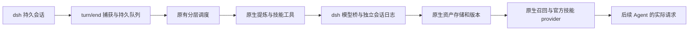

# dsh-rsi 实现进度

更新：2026-10-03。兼容目标为官方安装版 dsh `0.2.0-rc.2`、Cordis `4.0.4`、Node 24。已有可构建的本地开发插件；尚未公开发布，也没有真实模型 benchmark 效果结论。

## 已实现并验证

| 能力 | 实现与证据 |
| --- | --- |
| 自动任务捕获 | 监听正式 `session/event` 中的 `turn/end`，等待宿主持久化后读取原始日志；固定响应夹具下，真实 Agent 的任务进入学习队列 |
| 原生 Chat Memory | 使用复用的 L0 记录、L1 提炼/去重/写入、SQLite FTS5 中文召回、L2 SceneExtractor、L3 PersonaGenerator |
| 原生 Skill 自进化 | SkillExtractor 原有工具循环调用 SkillCore、版本与资源存储；使用固定本地身份映射，没有管理服务栈 |
| 后续任务消费 | 使用 `agent/pre-step` 注入正式消息，官方技能 provider 与 `skill` 工具加载实际正文；持久日志重建与实际模型请求一致 |
| 资产管理 | 记忆纠正、技能禁用和版本回退影响实际消费；已有技能复制含二进制资源，通用副本跨工作区可见 |
| 隔离和恢复 | 工作区通过规范化真实路径哈希映射到独立目录；通用资产单独存放；独立进程恢复资产、版本及中断记录 |
| 预算 | 每次后台模型 dispatch 前预留调用额度；额度耗尽不发送新请求；缺失 token 用量保留未知状态 |
| 管理 API | 官方 Host Gateway + 官方 Client RPC 投影实际调用成功；客户端主动挂载自己的 namespace |
| 资产语言 | 默认 `zh-CN`，切换影响后续生成；手动转换使用同一模型桥，保留 Skill 历史版本与记忆追加历史 |

回执：[闭环检查](evidence/runtime-phase2.json)、[模型桥接检查](evidence/bridge-phase2.json)。这些检查使用临时 DSH_HOME、临时资产和固定模型响应；没有调用真实提供商，没有执行任务代码。原生 L2/L3 方法及其工具和召回已经实测；定时器在长期会话中的调度和恢复尚需长时间试用。

## 界面

已编写插件详情页的「概览 / 记忆 / 技能 / 设置」四个标签，包括工作区选择、学习状态与队列、搜索与纠正、版本正文和变更片段、禁用、复制、语言、预算、导出和清理。

客户端按官方闭包工厂格式构建，通过 `plugins.bundle.config` 插槽注册。Browser 交互夹具加载同一个构建产物，验证渲染、记忆编辑、版本窗口和设置控件。界面夹具使用模拟业务数据；官方 Client→Host Gateway 的调用另外在安装版运行时验证。**用户桌面已安装本地链接。管理页缺失已修复，独立官方 web profile 已通过实际挂载、页签切换、设置保存与启停检查；个人桌面重启后的修复结果待用户确认。**

## 核心复用与新增边界

保留的 56 个运行时源码文件来自固定修订 `e09899c2136fb6bc27ecc68505e32bdb637cdfa8`，构建前逐文件校验哈希。算法源文件未修改。新增的是宿主事件适配、正式模型日志、物理工作区映射、插件队列/预算、管理 API 和界面。

构建适配仅替换三个宿主边界：要求注入 dsh runner、使用原有 Noop 观测后端、关闭原宿主日志目录。没有另建 Python 记忆/技能实现，没有直接请求提供商的模型客户端。复用源码有少量未纳入运行时构建的类型依赖；当前构建不是完整原仓库的类型检查。

## 调用链与日志

模型桥先写入并 flush 标准日志事件，再执行正式 `prepareCall().stream()`。这是同一个 `llm/stream` waterfall。工具执行前保存完整调用；参数校验、迭代限制、模型错误、预取消、超时和失败收尾均已检查。后台没有终端或工作区写文件工具；L2/L3 仅操作自己的 profile 存储，Skill 工具仅操作自己的资产库。

任务队列保存完整源日志和处理阶段，重启将正在处理的工作标为中断。已保存的阶段可以跳过；崩溃发生在写资产与保存阶段之间时，仍可能重复提炼。不能声称整轮事务回滚或恰好执行一次。失败记录提示可能存在部分更新。

## 默认设置与目录

默认目录：`$DSH_HOME/plugin-data/dsh-rsi`；没有 DSH_HOME 时为 `~/.dsh/plugin-data/dsh-rsi`。可通过插件配置覆盖绝对 `dataDir`。内部结构：

- `rsi-state.sqlite`：设置、调用计数、任务队列及原生管道检查点。
- `scopes/global/`：通用资产。
- `scopes/<workspace-hash>/`：工作区资产；各自有记忆数据库、技能数据库、JSONL 历史、技能附件和场景画像。
- `learning-runs/`：后台日志与来源关联。会话日志本体由宿主持久化服务管理。

同一数据目录只允许一个活跃实例，避免两个进程同时学习。工作区以 realpath 区分，因此同一目录的符号链接名称不会产生两个资产库。

默认：自动学习开启，语言中文；每日 100 次后台请求；单次最多 4096 输出 token、16 次模型迭代、180 秒超时；稳定阶段每 2 轮或空闲 30 秒触发。保留原生 warmup，因此首次任务可能立即学习。每日额度按 UTC 日期重置，包含失败请求和工具循环的每次 dispatch，不是每日成本金额上限。

L2 采用原生延迟/间隔规则；手动「处理待学习任务」等待 L1 和 Skill，L2/L3 仍按原生队列继续。修改学习间隔会重建原生管道，管道销毁遵循原有 flush 语义。语言转换和画像重建是用户明确发起的学习调用，即使自动学习暂停也允许执行，但仍受每日预算约束。

## 管理语义与限制

- 技能对 dsh 的名称是 `rsi-<原生名称>`，独立目录与 provider 避免覆盖已有技能。
- 禁用只影响消费，不删除历史。回退把旧正文和附件写成新版本；原有过期版本规则仍适用。
- 记忆纠正更新原生索引并保存历史；旧场景/画像暂不注入，随后分层重建或手动重建后恢复。
- 导出包含当前记忆、记忆追加历史、Skill 历史正文/附件、派生 profile 文件和队列来源；尚无导入恢复向导。
- 清理需要暂停学习、等待当前任务结束、输入确认。删除所选范围内的插件资产、历史版本和队列；宿主原始会话日志、预算记账和来源游标继续保留，避免清理后重学旧任务。后台日志本体及其关联索引不因资产清理而自动删除。
- 自动 `persona` 类型进入通用库，其余记忆保持工作区范围。具体模型分类准确性尚未通过真实任务验证。
- 当前使用原有 FTS5 关键词检索及中文分词，没有启用嵌入服务或向量扩展。
- 本地包保持 `private: true`；源码、管理页面和运行时接口均不是经过正式发布验收的版本。

## 下一阶段

1. 临时桌面/网页 profile 中完成本地 bundle 安装、管理页挂载和启停验收。
2. 把实际 Agent 的全部任务工具放入容器，验证所有文件、shell、子进程入口及网络边界；禁止把 sdk-minimal 默认 profile 当作实验沙箱。
3. 验证官方判分器，再固定题单、模型、预算及快照协议，运行完整插件与原始 dsh 的配对 benchmark。

本机 Docker Server `29.0.1` 可用。只读可用性检查不等于任务执行隔离已经成立；目前没有正式任务分数或效果数据。

## 管理页面改版与复用约束

管理页改为已有资产工作台的列表/详情结构。直接复用分栏拖拽、资产列表、页头、Markdown 组件和技能资源文件树；保留源文件与哈希，必要的宿主包装、样式变量和数据绑定在适配层完成。详见 [管理页面复用记录](ui-reuse.md)。

新增的分层浏览、技能编辑和资源预览接口均调用原生存储/版本方法。运行时验证覆盖 L0–L3 的管理读取、原生 META 解析、版本冲突及资源路径校验，未调用真实模型。后续开发按 `AGENTS.md` 的最小修改与直接复用要求执行。

## 安装包检查

增加 `prepare` 源码构建钩子，显式外置 React 与 JSX runtime，并用构建依赖图检查没有嵌入 React。全新源码目录的安装生命周期、tarball 生产依赖安装、服务端导出和原生中文 FTS 分词在 macOS ARM64 上通过；生产消费者不含 esbuild。见 [安装包回执](evidence/package-20261002.json)与[发布审查](packaging-review.md)。

Linux/macOS/Windows CI 配置已提交并推送，运行结果尚未核对。远程 Git URL 安装、桌面挂载、跨平台结果及真实 benchmark 仍未验收，`private: true` 保持为当前开发包的发布保护。

## 实际客户端挂载（2026-10-03）

修复 keyed 插槽误用 id 和缺少包清单导出的问题。独立官方 web profile 的管理页、实际 RPC 设置保存、停用卸载与重新启用均通过；自动学习暂停，模型调用为 0。见 [挂载修复记录](client-mount-review.md)和[回执](evidence/client-mount-20261003.json)。个人桌面更新后仍需用户确认，真实模型和任务容器验收仍待完成。
